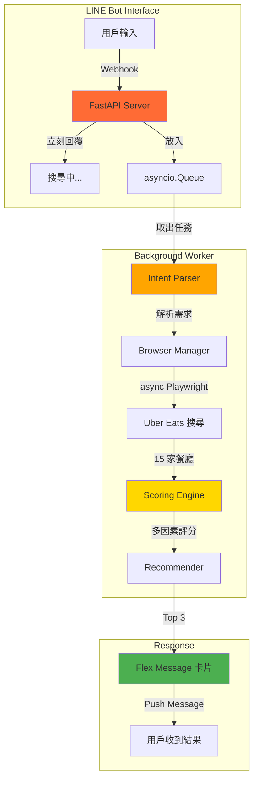

# 覓食 AI / Food Finder AI

> **Built by AI Agent in 6 Hours** | 由 AI Agent 在 6 小時內自主開發

[](https://opensource.org/licenses/MIT)
[](https://www.python.org/downloads/)
[](https://playwright.dev/)

[English](#english) | [繁體中文](#繁體中文)

---

## 繁體中文

### 📸 Demo 截圖

<div align="center">


*LINE 對話介面 - 輸入需求並收到推薦*


*推薦卡片 - 可左右滑動查看 Top 3*

</div>

---

### 🎯 這不是一個產品介紹，這是一個技術 Showcase

**核心亮點：**
- ✅ **完全由 AI Agent 開發**：從需求分析到上線，全程由 [OpenClaw](https://openclaw.ai) AI Agent 自主完成
- ✅ **6 小時從零到完整產品**：包含 Brain Layer（智慧推薦引擎）+ LINE Bot 介面
- ✅ **無 LLM 依賴**：純 Python 邏輯評分，零 API 成本
- ✅ **產品級架構**：Queue + Background Worker，支援並發請求

### 📱 功能展示

**用戶體驗：**
1. 在 LINE 輸入：「宵夜 300 內 要辣 30 分鐘」
2. 立刻收到：「🔍 搜尋中，請稍候...」
3. 10-20 秒後收到：**3 張推薦卡片**（可滑動）
   - 店名、評分、送達時間、價位
   - 智慧推薦理由
   - 一鍵跳轉 Uber Eats

**智慧評分引擎：**
- 多因素評分：偏好匹配 35%、價格 20%、ETA 20%、評分 15%、熱門度 10%
- 自動過濾不符合需求的選項（例如要「辣」不會推薦便利商店）

---

### 🏗️ 架構圖



---

### 🛠️ 技術棧

**後端架構：**
- **FastAPI** - 現代化 async web framework
- **asyncio.Queue** - 生產者-消費者模式，避免 webhook 超時
- **async Playwright** - 無頭瀏覽器自動化
- **storage_state** - Cookie 管理，避免多線程衝突

**AI 核心：**
- **Intent Parser** - 自然語言 → 結構化需求（正則表達式）
- **Scoring Engine** - 多因素加權評分（純 Python）
- **Recommender** - 推薦理由生成（規則引擎）

**通訊介面：**
- **LINE Bot SDK** - Messaging API + Flex Message
- **ngrok** - 本地開發 webhook tunnel

**無依賴 LLM：** 所有邏輯用 Python 實作，零 API 成本

---

### 🚀 快速開始

#### 前置需求
- Python 3.10+
- Uber Eats 帳號（需先登入一次儲存 session）
- LINE Bot Channel（[申請教學](https://developers.line.biz/en/docs/messaging-api/getting-started/)）
- ngrok 帳號（[註冊](https://dashboard.ngrok.com/signup)）

#### 安裝步驟

1. **Clone 專案**
```bash
git clone https://github.com/zychenpeng/openclaw-delivery-agent.git
cd openclaw-delivery-agent
```

2. **安裝依賴**
```bash
pip install -r requirements.txt
playwright install chromium
```

3. **設定環境變數**
```bash
cp .env.example .env
# 編輯 .env，填入 LINE Bot credentials
```

4. **首次登入 Uber Eats（儲存 session）**
```bash
python export_auth_state.py
# 瀏覽器會開啟，登入 Uber Eats 後會自動儲存 auth_state.json
```

5. **設定 ngrok**
```bash
# 設定 authtoken
python -c "from pyngrok import ngrok; ngrok.set_auth_token('YOUR_NGROK_TOKEN')"
```

6. **啟動 LINE Bot**
```bash
cd interfaces/line_bot
python start_bot.py
```

7. **設定 LINE Webhook**
- 複製 ngrok 提供的 HTTPS URL
- 前往 [LINE Developers Console](https://developers.line.biz/console/)
- 設定 Webhook URL: `https://your-ngrok-url/webhook`
- 開啟「Use webhook」

8. **測試**
- 加 Bot 為好友
- 傳送：「宵夜 300 內 要辣 30 分鐘」
- 等待推薦結果！

---

### 📂 專案結構

```
openclaw-delivery-agent/
├── agent/
│   ├── scrapers/
│   │   ├── browser_manager.py      # 瀏覽器管理
│   │   └── ubereats/
│   │       ├── search.py           # 搜尋 + 去重
│   │       └── menu.py             # 菜單抓取
│   └── planner/
│       ├── intent_parser.py        # 需求解析（NLP-lite）
│       ├── scorer.py               # 評分引擎（多因素加權）
│       └── recommender.py          # 推薦生成器
├── interfaces/
│   └── line_bot/
│       ├── app.py                  # FastAPI webhook server
│       ├── worker_v2.py            # Background worker
│       ├── flex_messages.py        # LINE Flex Message 模板
│       └── start_bot.py            # 啟動腳本（含 ngrok）
├── export_auth_state.py            # 匯出登入狀態
├── .env.example                    # 環境變數範本
└── README.md                       # 本文件
```

---

### 🧠 技術細節

#### 1. Queue + Background Worker 架構

**問題：** Playwright 搜尋需 10-20 秒，LINE webhook 有 timeout 限制

**解決：**
```python
# Webhook handler（立刻回覆）
@handler.add(MessageEvent, message=TextMessage)
def handle_message(event):
    # 放入 Queue
    asyncio.create_task(task_queue.put({
        'user_id': user_id,
        'message': user_message
    }))
    # 立刻回覆
    line_bot_api.reply_message(event.reply_token, 
        TextSendMessage(text="🔍 搜尋中..."))

# Background worker（獨立處理）
async def background_worker():
    while True:
        task = await task_queue.get()
        result = await search_and_recommend(task['message'])
        # 完成後 push message
        line_bot_api.push_message(task['user_id'], result)
```

#### 2. storage_state 取代 persistent_context

**問題：** `persistent_context` 在多線程環境中會衝突

**解決：**
```python
# 一次性匯出 cookies
context = playwright.chromium.launch_persistent_context("profile")
context.storage_state(path="auth_state.json")

# 每次任務建新 context（載入 cookies）
browser = await playwright.chromium.launch()
context = await browser.new_context(storage_state="auth_state.json")
# 用完即關閉
await context.close()
```

#### 3. 智慧評分引擎

**權重配置：**
```python
DEFAULT_WEIGHTS = {
    "preference_match": 0.35,  # 偏好匹配（最重要）
    "price_score": 0.20,       # 價格合理性
    "eta_score": 0.20,         # 送達時間
    "rating_score": 0.15,      # 店家評分
    "popularity": 0.10,        # 熱門度
}
```

**偏好匹配邏輯：**
- 符合偏好（例如「辣」）：0.85-1.0 分
- 不符合偏好：0.3 分
- 便利商店等通用店：0.25 分（大幅扣分）

---

### 🎓 開發歷程

**Timeline（6 小時）：**
- **Hour 0-2:** Phase 0 PoC（Playwright 爬蟲驗證）
- **Hour 2-4:** Phase 1 Brain Layer（Intent Parser + Scorer + Recommender）
- **Hour 4-6:** Phase 2 LINE Bot（FastAPI + Queue + Flex Message）

**關鍵突破：**
1. ❌ 初版用 `persistent_context` → 多線程衝突
2. ✅ 改用 `storage_state`（顧問建議）
3. ❌ URL 包含中文 → LINE Flex Message 拒絕
4. ✅ 用 `urllib.parse.quote()` 編碼

**AI Agent 貢獻：**
- 需求分析 & 架構設計
- 完整程式碼實作
- Bug 診斷 & 修復
- 文件撰寫

**人類貢獻：**
- 產品方向建議
- 技術架構諮詢（CIO）
- 測試 & 回饋

---

### 🔮 未來方向

**短期（可選）：**
- [ ] 多平台比價（foodpanda + Uber Eats）
- [ ] 位置支援（LINE Location Message）
- [ ] 歷史紀錄（記住用戶偏好）

**長期（探索）：**
- [ ] 真正的 LLM 對話（處理複雜需求）
- [ ] Web 介面（不只 LINE）
- [ ] 價格追蹤 & 促銷通知

---

### ⚠️ 免責聲明

本專案僅供**技術學習**與**概念驗證**使用。

- 爬蟲行為可能違反服務條款（Uber Eats ToS）
- 不建議用於商業用途或大規模部署
- 使用者需自行承擔風險

**建議：**
- 只抓取公開資訊
- 控制請求頻率（避免過載）
- 考慮使用官方 API（如果開放）

---

### 📄 授權

MIT License - 詳見 [LICENSE](LICENSE) 文件

---

### 🙏 致謝

- **OpenClaw** - AI Agent 開發平台
- **CIO** - 技術架構諮詢
- **Playwright** - 優秀的自動化工具
- **LINE** - Messaging API & Flex Message

---

## English

### 📸 Demo Screenshots

<div align="center">


*LINE Conversation Interface - Input requirements and receive recommendations*


*Recommendation Cards - Swipe to view Top 3*

</div>

---

### 🎯 This is NOT a Product Demo, It's a Technical Showcase

**Highlights:**
- ✅ **Fully Built by AI Agent**: From requirement analysis to deployment, autonomously developed by [OpenClaw](https://openclaw.ai) AI Agent
- ✅ **0 to Production in 6 Hours**: Including Brain Layer (smart recommendation engine) + LINE Bot interface
- ✅ **No LLM Dependency**: Pure Python logic for scoring, zero API cost
- ✅ **Production-Grade Architecture**: Queue + Background Worker, supports concurrent requests

### 📱 Feature Demo

**User Experience:**
1. Input in LINE: "Late night snack, budget $300, spicy, within 30 mins"
2. Instant reply: "🔍 Searching, please wait..."
3. 10-20 seconds later: **3 recommendation cards** (swipeable)
   - Restaurant name, rating, ETA, price range
   - Smart recommendation reason
   - One-tap jump to Uber Eats

**Smart Scoring Engine:**
- Multi-factor scoring: Preference match 35%, Price 20%, ETA 20%, Rating 15%, Popularity 10%
- Auto-filter irrelevant options (e.g., won't recommend convenience stores when "spicy" is requested)

---

### 🛠️ Tech Stack

**Backend:**
- **FastAPI** - Modern async web framework
- **asyncio.Queue** - Producer-consumer pattern, avoids webhook timeout
- **async Playwright** - Headless browser automation
- **storage_state** - Cookie management, avoids multi-threading conflicts

**AI Core:**
- **Intent Parser** - Natural language → Structured requirements (regex-based)
- **Scoring Engine** - Multi-factor weighted scoring (pure Python)
- **Recommender** - Recommendation reason generator (rule engine)

**Communication:**
- **LINE Bot SDK** - Messaging API + Flex Message
- **ngrok** - Local development webhook tunnel

**No LLM Dependency:** All logic implemented in Python, zero API cost

---

### 🚀 Quick Start

#### Prerequisites
- Python 3.10+
- Uber Eats account (need to log in once to save session)
- LINE Bot Channel ([Setup Guide](https://developers.line.biz/en/docs/messaging-api/getting-started/))
- ngrok account ([Sign up](https://dashboard.ngrok.com/signup))

#### Installation

1. **Clone the project**
```bash
git clone https://github.com/zychenpeng/openclaw-delivery-agent.git
cd openclaw-delivery-agent
```

2. **Install dependencies**
```bash
pip install -r requirements.txt
playwright install chromium
```

3. **Configure environment variables**
```bash
cp .env.example .env
# Edit .env, fill in your LINE Bot credentials
```

4. **First-time login to Uber Eats (save session)**
```bash
python export_auth_state.py
# Browser will open, log in to Uber Eats, session will be auto-saved to auth_state.json
```

5. **Setup ngrok**
```bash
# Set authtoken
python -c "from pyngrok import ngrok; ngrok.set_auth_token('YOUR_NGROK_TOKEN')"
```

6. **Start LINE Bot**
```bash
cd interfaces/line_bot
python start_bot.py
```

7. **Configure LINE Webhook**
- Copy the HTTPS URL provided by ngrok
- Go to [LINE Developers Console](https://developers.line.biz/console/)
- Set Webhook URL: `https://your-ngrok-url/webhook`
- Enable "Use webhook"

8. **Test**
- Add the bot as a friend
- Send: "Late night snack, budget $300, spicy, within 30 mins"
- Wait for recommendations!

---

### 🎓 Development Journey

**Timeline (6 hours):**
- **Hour 0-2:** Phase 0 PoC (Playwright scraper validation)
- **Hour 2-4:** Phase 1 Brain Layer (Intent Parser + Scorer + Recommender)
- **Hour 4-6:** Phase 2 LINE Bot (FastAPI + Queue + Flex Message)

**Key Breakthroughs:**
1. ❌ Initial version used `persistent_context` → multi-threading conflicts
2. ✅ Switched to `storage_state` (consultant suggestion)
3. ❌ URL contains Chinese characters → LINE Flex Message rejected
4. ✅ Used `urllib.parse.quote()` for encoding

**AI Agent Contributions:**
- Requirement analysis & architecture design
- Complete code implementation
- Bug diagnosis & fixes
- Documentation writing

**Human Contributions:**
- Product direction suggestions
- Technical architecture consulting (CIO)
- Testing & feedback

---

### ⚠️ Disclaimer

This project is for **technical learning** and **proof of concept** only.

- Web scraping may violate Terms of Service (Uber Eats ToS)
- Not recommended for commercial use or large-scale deployment
- Users assume all risks

**Recommendations:**
- Only scrape publicly available information
- Control request frequency (avoid overload)
- Consider using official APIs (if available)

---

### 📄 License

MIT License - See [LICENSE](LICENSE) file for details

---

### 🙏 Acknowledgments

- **OpenClaw** - AI Agent development platform
- **CIO** - Technical architecture consulting
- **Playwright** - Excellent automation tool
- **LINE** - Messaging API & Flex Message

---

**⭐ If this project helped you understand AI Agent development, please give it a star!**
